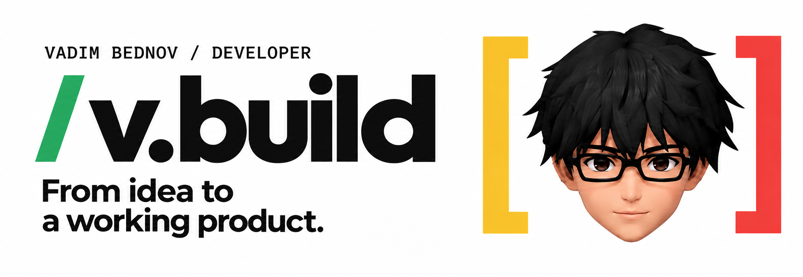

<a href="https://github.com/vaoaoadim">EN</a> / <b>RU</b>

# Выразительный интерфейс. Работающий продукт.

Я **Вадим Беднов**, независимый разработчик **v.build**. Создаю сайты, веб-приложения, Telegram mini apps, ботов, расширения и автоматизации — от интерфейса до серверной части, баз данных и интеграций.

**Есть идея проекта? Давайте обсудим.**

## 01 / Что могу разработать

- **Сайты и веб-приложения** — выразительные адаптивные интерфейсы и работающие системы.
- **Telegram-продукты** — мини-приложения, боты, уведомления и интеграции сервисов.
- **Интерактивные проекты** — маркетинговые игры и геймификация для бизнеса.
- **Инструменты и автоматизация** — расширения браузера, API, рабочие процессы и AI-интеграции.
- **Многое многое другое)**

Собираю проекты целиком: frontend, серверную часть, базы данных и сторонние интеграции. При передаче проекта вы получаете **поддержку и подробный FAQ**.

## Избранные проекты

### [ХОЧЕЦА ↗](https://t.me/hochesa_bot)

**Мини-приложение в Telegram · Вишлисты**

Вишлисты для себя и своих близких. Место для идей подарков, которое помогает проще выбрать, что подарить.

[Открыть в Telegram](https://t.me/hochesa_bot)

### [BeautyBomb Delivery ↗](https://beautybomb-delivery.vercel.app)

**Браузерная игра · Phaser 3.90**

Аркадная игра про доставку — **независимый портфолио-концепт**, а не заказной проект для BeautyBomb.

[Играть](https://beautybomb-delivery.vercel.app) · [Посмотреть код](https://github.com/vaoaoadim/BeautyBomb-delivery-game)

### [Pläner ↗](https://planer-eight.vercel.app)

**Веб-приложение · Личное планирование**

Уютный недельный планер для задач, сна, настроения, энергии, привычек, календаря и личной статистики.

[Открыть Pläner](https://planer-eight.vercel.app) · [Публичная страница проекта](https://github.com/vaoaoadim/Planer-app)

## 02 / Стек под задачу

**Frontend** — React · TypeScript · JavaScript · Vite · HTML/CSS · GSAP  
**Backend и данные** — Node.js · REST APIs · Webhooks · PostgreSQL · Supabase · Firebase  
**Интеграции** — Telegram Bot API · Платёжные и почтовые сценарии · OpenAI API · RAG  
**Публикация** — Git · GitHub · CI/CD · Vercel · Cloudflare

Стек подбирается под конкретную задачу индивидуально и не ограничивается вышеперечисленным.

<b>Есть идея, но пока нет технического задания?</b>

Напишите, для кого нужен продукт, какую задачу он должен решать и какие примеры вам нравятся. Если есть срок или ориентир по бюджету, тоже укажите их. Начать можно с идеи, а не с идеального ТЗ.

[Написать в Telegram](https://t.me/vaoaoadim) или на **vbednov921@gmail.com**.

---

**Из идеи — в работающий продукт.** [Обсудить проект ↗](https://t.me/vaoaoadim)
